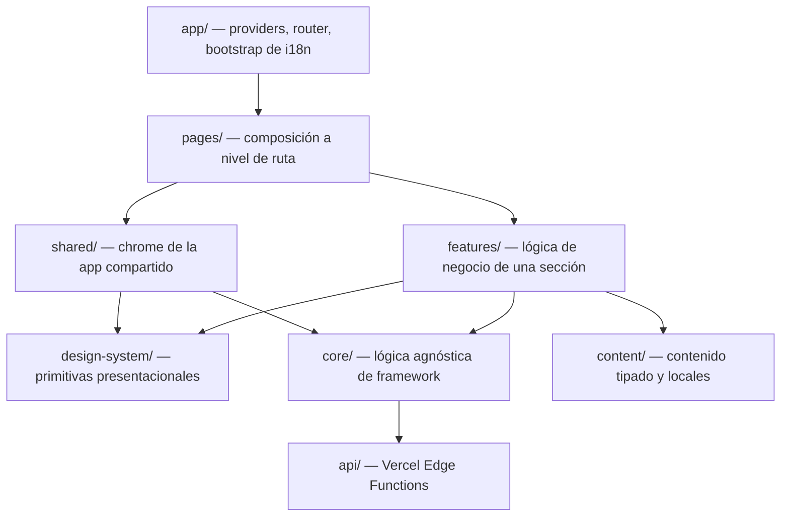

# Arquitectura

**[🇬🇧 Read in English](./ARCHITECTURE.md)**

Este documento explica cómo está organizado el código y por qué — el layering, las reglas de dependencia entre capas, y el razonamiento detrás de las decisiones técnicas que no son obvias al leer un solo archivo. Para convenciones del día a día (reglas de TypeScript, patrones de componentes, estilos, accesibilidad), ver [`CLAUDE.md`](./CLAUDE.md); este documento es el "por qué", ese otro es el "cómo".

## Capas

Una flecha significa "puede importar de". La regla que más importa: **las dependencias apuntan hacia abajo, nunca hacia los lados ni hacia arriba.** Un `feature` puede usar `design-system` y `core`; `design-system` nunca importa de un `feature`; dos `features` nunca importan la implementación interna del otro.

| Capa | Contiene | Ejemplo |
|---|---|---|
| `app/` | Raíz de composición — providers, enrutamiento, bootstrap de i18n. Sin lógica de negocio. | `app/router/AppRoutes.tsx`, `app/i18n/i18n.ts` |
| `pages/` | Ensambla features en una ruta. Delgado — solo composición. | `pages/Home/HomePage.tsx` |
| `features/` | El comportamiento de una sección del portafolio: shaping de datos, estado local, los componentes propios de esa sección. | `features/contact/ContactForm.tsx` |
| `shared/` | "Chrome" a nivel de app usado en toda la página, no perteneciente a ninguna sección: header, footer, command palette, el widget del asistente de IA, la terminal. | `shared/layout/CommandPalette/CommandPalette.tsx` |
| `design-system/` | Primitivas reutilizables y presentacionales sin lógica específica de ninguna feature. | `design-system/Button/Button.tsx`, `design-system/Modal/Modal.tsx` |
| `core/` | Lógica agnóstica de framework sin UI: hooks, clientes de API, theming, SEO, utilidades de fecha/formato. | `core/theme/useTheme.ts`, `core/api/assistantClient.ts` |
| `content/` | Contenido tipado y traducciones — la única fuente de verdad de lo que dice el portafolio, separada de cómo se renderiza. | `content/experience/experience.ts`, `content/locales/en.json` |
| `styles/` | Design tokens (colores, espaciado, motion, breakpoints) como custom properties CSS, resets base, definiciones de tema. | `styles/tokens/_colors.scss` |
| `api/` | Vercel Edge Functions — el único lugar donde pueden existir secretos (`GEMINI_API_KEY`, `GITHUB_TOKEN`). | `api/chat.ts`, `api/github.ts` |

### Por qué esta forma

`features` vs. `shared` es la única frontera que no es autoexplicativa: un **feature** está acotado a una sección de la página y aparece una sola vez (`ContactForm`, `ProjectsSection`); **shared** es chrome a nivel de app que no es "propiedad" de ninguna sección y puede aparecer sin importar la posición del scroll (`SiteHeader`, `CommandPalette`, `Launcher`, `Terminal`). Cuando algo que empezó como comportamiento local de un feature termina siendo necesario en más de una sección, baja a `core` (un hook/utilidad) o a `design-system` (una primitiva presentacional) — nunca se mueve lateralmente a otro feature.

## El contenido es dato, no markup

El texto de cada sección vive en un módulo tipado bajo `content/` (`content/experience/experience.ts`, `content/projects/projects.ts`, …), separado de las cadenas traducidas en `content/locales/{en,es}.json`. Un componente lee datos estructurados (fechas, tags, ids) de lo primero y texto legible de lo segundo vía `useTranslation()`. Esto es lo que permite que `api/chat.ts` construya el contexto de anclaje del asistente de IA directamente a partir del mismo contenido que renderiza la página — perfil, experiencia, educación, skills y proyectos — en vez de mantener una segunda copia de "qué dice este portafolio" para que el asistente la use. Si las respuestas del asistente y la página alguna vez no coinciden, es un bug de contenido, no de prompt.

## Theming

Cada color, valor de espaciado y duración de animación es una custom property CSS (`--color-accent`, `--space-4`, `--motion-duration-base`, …), definida una vez en `styles/tokens/` y sobrescrita por tema en `styles/themes/_dark.scss`. Los componentes consumen el token, nunca un valor hardcodeado — un componente no sabe ni le importa qué tema está activo. `useTheme()` (`core/theme/useTheme.ts`) es el único lugar que lee/escribe `document.documentElement.dataset.theme` y `localStorage`.

**El cambio de tema en sí está dividido por tipo de dispositivo**, no solo visualmente sino mecánicamente:

- **Escritorio/tablet** (`≥ md`): la View Transitions API nativa anima una revelación circular que se expande desde el punto de clic (`document.startViewTransition`, impulsado por un keyframe de `clip-path` en `styles/base/_view-transitions.scss`).
- **Móvil** (`< md`): un simple cross-fade de opacidad.

Esta división existe porque la animación de `clip-path` de la revelación circular pierde frames de forma medible en GPUs Android de gama media — una regresión real detectada durante el desarrollo, no algo hipotético. En vez de quitar el efecto (que en escritorio nadie notó nada mal) o aceptar el lag en todos lados, la revelación solo corre donde realmente es barata. Ambas variantes respetan `prefers-reduced-motion` (se omiten por completo) y están definidas en `@keyframes` de CSS, no en JavaScript, así que es el compositor del navegador quien las impulsa, no el hilo principal.

## Frontera serverless

`api/*.ts` son [Vercel Edge Functions](https://vercel.com/docs/functions) — el único código del repo autorizado a tener `GEMINI_API_KEY` o `GITHUB_TOKEN`. Son funciones simples de `Request → Promise<Response>` que solo usan APIs estándar de la Web (`fetch`, `Request`, `Response`), así que no agregan ninguna dependencia (sin SDK de Vercel, sin SDK de Google) y corren de forma idéntica en tres lugares:

1. **Producción** — Vercel despliega cada archivo como su propia Edge Function.
2. **Desarrollo local** — `localApiPlugin.ts`, un pequeño middleware de Vite, carga el mismo archivo a través del grafo de módulos SSR de Vite y adapta el `req`/`res` de Node al `Request`/`Response` que ya habla. Hay exactamente una copia de la lógica de cada handler.
3. **Tests** — `api/chat.test.ts` y `api/github.test.ts` llaman al handler exportado directamente con un `Request` real, con `/* @vitest-environment node */` ya que no hay DOM involucrado.

El cliente nunca habla directamente con APIs de terceros (Gemini, GitHub) — `core/api/assistantClient.ts` y `shared/layout/GithubRepos/githubApi.ts` llaman ambos a `/api/*`, manteniendo cada credencial real del lado del servidor.

## Manejo de estado

No hay ninguna librería de estado global. El estado vive en el nivel que realmente lo necesita:

- **Estado local de componente** para cualquier cosa acotada a un solo componente (el estado de envío de `ContactForm`, la query de `CommandPalette`).
- **Un hook personalizado** cuando la lógica necesita reutilizarse o es lo suficientemente compleja como para merecer nombre (`useTheme`, `useGithubActivity`, `useActiveSection`).
- **Estado en la URL** (`/#section-id`) para la navegación, así una sección es enlazable y el botón atrás del navegador funciona.

Esto es una lectura deliberada de la regla de disciplina de dependencias del proyecto ([`CLAUDE.md`](./CLAUDE.md) §34, "Dependency Discipline"): una librería de estado resuelve un problema que esta app todavía no tiene. Si en algún momento surge estado realmente transversal, pertenece a `core/`, no atornillado al primer feature que lo necesitó.

## Arquitectura de testing

Tres capas, cada una enfocada en lo que realmente hace bien — ver [`TESTING.md`](./TESTING.md) para el desglose completo:

- **Tests unitarios** (Vitest) — funciones puras y hooks de forma aislada: `formatMonthYear`, `useTheme`, los dos handlers de API.
- **Tests de componentes** (Vitest + React Testing Library) — el comportamiento observable de un componente a través de queries accesibles (rol, label, texto visible), nunca clases CSS o estructura del DOM: el flujo de envío de `ContactForm`, el filtrado de `CommandPalette`.
- **Tests E2E** (Playwright) — un puñado de flujos de usuario reales a través de la app corriendo de verdad: cargar la home, navegar a una sección, abrir un proyecto, cambiar el tema, enviar el formulario de contacto.

El coverage se mide solo sobre archivos con lógica real (`coverage.include` en `vitest.config.ts` es una allowlist explícita), no sobre todo el árbol `src/` — la mayor parte de este código base es JSX presentacional sin ramas que valga la pena cubrir, e incluirlo diluiría el número sin atrapar bugs reales.

## Fondo de constelación

El fondo de red de partículas (`shared/layout/Constellation/`) es un único `<canvas>` montado una sola vez a nivel de página (`position: fixed`, así nunca necesita ser del alto del documento), no por sección. Es `aria-hidden` y está condicionado a un `matchMedia` de ancho de escritorio y a `prefers-reduced-motion`, y su loop de `requestAnimationFrame` se pausa vía la Page Visibility API cada vez que la pestaña pasa a segundo plano — un efecto decorativo que no cuesta nada cuando nadie puede verlo. Los colores de las partículas ambiente usan un token dedicado `--color-constellation` (no `--color-text-primary`, que es suficientemente oscuro en modo claro como para chocar visualmente con los títulos); las líneas hacia el cursor usan `--color-accent`, así el color de acento se lee como una reacción al visitante en vez de un tinte constante.
