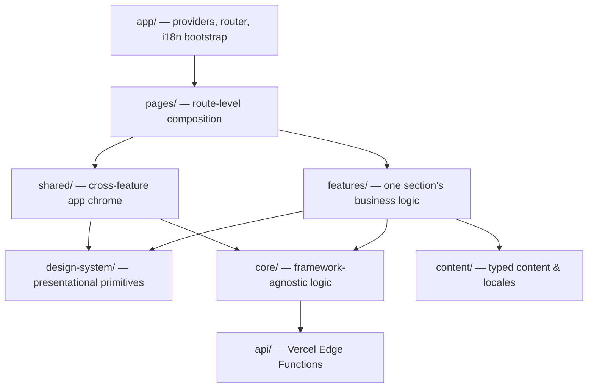

# Architecture

**[🇪🇸 Leer en español](./ARCHITECTURE.es.md)**

This document explains how the codebase is organized and why — the layering, the dependency rules between layers, and the reasoning behind the technical decisions that aren't obvious from reading a single file. For day-to-day conventions (TypeScript rules, component patterns, styling, accessibility), see [`CLAUDE.md`](./CLAUDE.md); this document is the "why," that one is the "how."

## Layers

An arrow means "may import from." The rule that matters most: **dependencies point downward, never sideways or up.** A `feature` may use `design-system` and `core`; `design-system` never imports from a `feature`; two `features` never import each other's internals.

| Layer | Owns | Example |
|---|---|---|
| `app/` | Composition root — providers, routing, i18n bootstrap. No business logic. | `app/router/AppRoutes.tsx`, `app/i18n/i18n.ts` |
| `pages/` | Assembles features into a route. Thin — just composition. | `pages/Home/HomePage.tsx` |
| `features/` | One portfolio section's behavior: data shaping, local state, the section's own components. | `features/contact/ContactForm.tsx` |
| `shared/` | App-level "chrome" used across the whole page, not owned by any one section: header, footer, command palette, the AI assistant widget, the terminal. | `shared/layout/CommandPalette/CommandPalette.tsx` |
| `design-system/` | Reusable, presentational primitives with no feature-specific logic. | `design-system/Button/Button.tsx`, `design-system/Modal/Modal.tsx` |
| `core/` | Framework-agnostic logic with no UI: hooks, API clients, theming, SEO, date/format utilities. | `core/theme/useTheme.ts`, `core/api/assistantClient.ts` |
| `content/` | Typed content and translations — the single source of truth for what the portfolio says, separate from how it's rendered. | `content/experience/experience.ts`, `content/locales/en.json` |
| `styles/` | Design tokens (colors, spacing, motion, breakpoints) as CSS custom properties, base resets, theme definitions. | `styles/tokens/_colors.scss` |
| `api/` | Vercel Edge Functions — the only place secrets (`GEMINI_API_KEY`, `GITHUB_TOKEN`) are allowed to exist. | `api/chat.ts`, `api/github.ts` |

### Why this shape

`features` vs. `shared` is the one boundary that isn't self-explanatory: a **feature** is scoped to one section of the page and shows up once (`ContactForm`, `ProjectsSection`); **shared** is app-level chrome that isn't "owned" by any single section and can appear regardless of scroll position (`SiteHeader`, `CommandPalette`, `Launcher`, `Terminal`). When something that started as feature-local behavior turns out to be needed by more than one section, it moves down into `core` (a hook/utility) or `design-system` (a presentational primitive) — never sideways into another feature.

## Content is data, not markup

Every section's copy lives in a typed module under `content/` (`content/experience/experience.ts`, `content/projects/projects.ts`, …), separate from `content/locales/{en,es}.json`'s translated strings. A component reads structured data (dates, tags, ids) from the former and human-readable text from the latter via `useTranslation()`. This is what lets `api/chat.ts` build the AI assistant's grounding context directly from the same content the page renders — profile, experience, education, skills, and projects — instead of maintaining a second copy of "what this portfolio says" for the assistant to draw from. If the assistant's answers and the page ever disagree, it's a content bug, not a prompt bug.

## Theming

Every color, spacing value, and motion duration is a CSS custom property (`--color-accent`, `--space-4`, `--motion-duration-base`, …), defined once in `styles/tokens/` and overridden per-theme in `styles/themes/_dark.scss`. Components consume the token, never a hardcoded value — a component doesn't know or care which theme is active. `useTheme()` (`core/theme/useTheme.ts`) is the only place that reads/writes `document.documentElement.dataset.theme` and `localStorage`.

**The theme switch itself is split by device class**, not just visually but mechanically:

- **Desktop/tablet** (`≥ md`): the native [View Transitions API](https://developer.chrome.com/docs/web-platform/view-transitions/) animates a circular reveal expanding from the click point (`document.startViewTransition`, driven by a `clip-path` keyframe in `styles/base/_view-transitions.scss`).
- **Mobile** (`< md`): a plain opacity cross-fade.

This split exists because the circular-reveal `clip-path` animation measurably drops frames on mid-range Android GPUs — a real regression caught during development, not a hypothetical. Rather than removing the effect (which desktop users never noticed anything wrong with) or accepting the jank everywhere, the reveal only runs where it's actually cheap. Both variants respect `prefers-reduced-motion` (skipped entirely) and are defined in CSS `@keyframes`, not JavaScript, so the browser's compositor drives them rather than the main thread.

## Serverless boundary

`api/*.ts` are [Vercel Edge Functions](https://vercel.com/docs/functions) — the only code in the repo allowed to hold `GEMINI_API_KEY` or `GITHUB_TOKEN`. They're plain functions of `Request → Promise<Response>` using only Web-standard APIs (`fetch`, `Request`, `Response`), so they add no dependency (no Vercel SDK, no Google SDK) and run identically in three places:

1. **Production** — Vercel deploys each file as its own Edge Function.
2. **Local dev** — `localApiPlugin.ts`, a small Vite middleware, loads the same file through Vite's SSR module graph and adapts Node's `req`/`res` to the `Request`/`Response` it already speaks. There's exactly one copy of each handler's logic.
3. **Tests** — `api/chat.test.ts` and `api/github.test.ts` call the exported handler directly with a real `Request`, `/* @vitest-environment node */` since there's no DOM involved.

The client never talks to third-party APIs (Gemini, GitHub) directly — `core/api/assistantClient.ts` and `shared/layout/GithubRepos/githubApi.ts` both call `/api/*`, keeping every real credential server-side.

## State management

There's no global state library. State lives at the level that actually needs it:

- **Local component state** for anything scoped to one component (`ContactForm`'s submit status, `CommandPalette`'s query).
- **A custom hook** when logic needs to be reused or is nontrivial enough to name (`useTheme`, `useGithubActivity`, `useActiveSection`).
- **URL state** (`/#section-id`) for navigation, so a section is linkable and the browser's back button works.

This is a deliberate reading of the project's dependency-discipline rule ([`CLAUDE.md`](./CLAUDE.md) §34, "Dependency Discipline"): a state library solves a problem this app doesn't have yet. If cross-cutting state actually emerges, it belongs in `core/`, not bolted onto whichever feature needed it first.

## Testing architecture

Three layers, each targeting what it's actually good at — see [`TESTING.md`](./TESTING.md) for the full breakdown:

- **Unit tests** (Vitest) — pure functions and hooks in isolation: `formatMonthYear`, `useTheme`, the two API handlers.
- **Component tests** (Vitest + React Testing Library) — a component's observable behavior through accessible queries (role, label, visible text), never CSS classes or DOM structure: `ContactForm`'s submit flow, `CommandPalette`'s filtering.
- **E2E tests** (Playwright) — a handful of real user journeys through the actual running app: load the home page, navigate to a section, open a project, toggle the theme, submit the contact form.

Coverage is measured only over files with actual logic (`vitest.config.ts`'s `coverage.include` is an explicit allowlist), not the whole `src/` tree — most of this codebase is presentational JSX with no branches worth covering, and including it would dilute the number without catching real bugs.

## Constellation background

The particle-network background (`shared/layout/Constellation/`) is a single `<canvas>` mounted once at the page level (`position: fixed`, so it never needs to be document-height), not per-section. It's `aria-hidden` and gated behind a desktop-width `matchMedia` check and `prefers-reduced-motion`, and its `requestAnimationFrame` loop pauses via the Page Visibility API whenever the tab is backgrounded — a decorative effect that costs nothing when nobody can see it. Ambient particle colors use a dedicated `--color-constellation` token (not `--color-text-primary`, which is dark enough in light mode to visually collide with headings); lines to the cursor use `--color-accent`, so the accent color reads as a reaction to the visitor rather than a constant tint.
